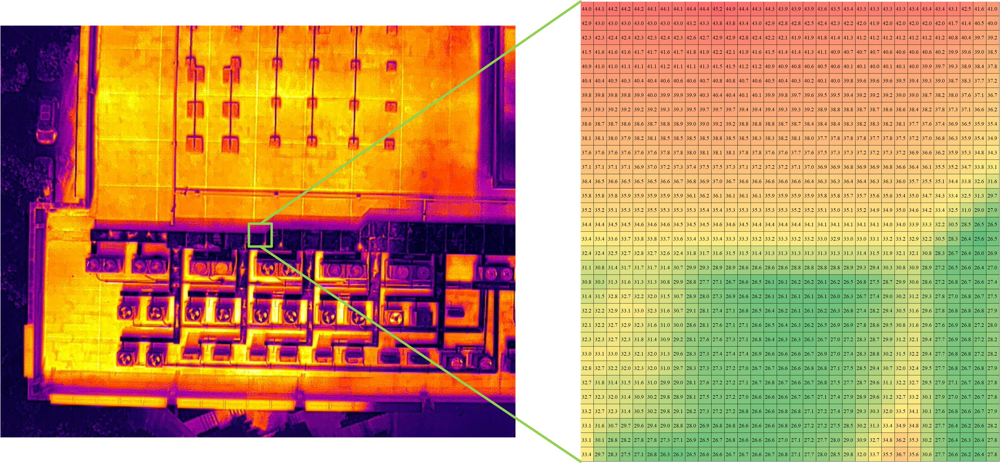

# FLIR/DJI IR Camera Data Parser, Python Version

Parser infrared camera data as `NumPy` data.



## Usage

* Clone this respository and `cd thermal_parser`. 
* Run `pip setup.py install` in the console.
* Try the following code:

**win x64, x86 & linux x64, x86**

```python
import numpy as np
from thermal_parser import Thermal

thermal = Thermal(dtype=np.float32)
temperature = thermal.parse(filepath_image='images/DJI_H20T.jpg')
assert isinstance(temperature, np.ndarray)
```

## Supported IR Camera

FLIR R-JPEG Camera Model

* FLIR
* FLIR AX8
* FLIR B60
* FLIR E40
* FLIR T640

DJI R-JPEG Camera Model

* DJI H20T
* DJI XT2
* DJI XTR
* DJI XTS / 禅思 Zenmuse XT S

DJI R-JPEG Camera Model DTAT3.0

* DJI M2EA / DJI MAVIC2-ENTERPRISE-ADVANCED / "御"2 行业进阶版
* DJI H20N / 禅思 H20N
* DJI M3T / DJI MAVIC3 / DJI Mavic 3 行业系列
* DJI M30T / 经纬 M30 系列
* DJI M3TD / 大疆机场 2
* DJI H30T / 禅思 H30 系列
* DJI M4T / DJI Matrice 4 系列

## References

* [DJI Thermal SDK](https://www.dji.com/cn/downloads/softwares/dji-thermal-sdk) The DJI Thermal SDK enables you to process R-JPEG (Radiometric JPEG) images which were captured by DJI infrared camera products. 
* [Thermal Image Analysis](https://github.com/detecttechnologies/Thermal-Image-Analysis) A tool for analyzing and annotating thermal images.
* [Base codes for Thermography](https://github.com/detecttechnologies/thermal_base) A python package for decoding and common processing for thermographs / thermograms
* [thermography](https://github.com/cdeldon/thermography) This repository contains the implementation of a feasibility study for automatic detection of defected solar panel modules.
* [TSDK (DJI Thermal SDK)](https://www.dji.com/global/downloads/softwares/dji-thermal-sdk)
* [DJI Thermal Analysis Tool 3](https://www.dji.com/global/downloads/softwares/dji-dtat3)

# Docker
```
sudo docker build -t dji-thermal .

mac
sudo docker run --rm -it --name dji-thermal -v $(pwd):/usr/src/app dji-thermal:latest

sudo docker run --rm -it --name dji-thermal -v $(pwd):/usr/src/app dji-thermal:latest python app.py


windows
sudo docker run --rm -it --name dji-thermal -v ${pwd}:/usr/src/app dji-thermal:latest

```